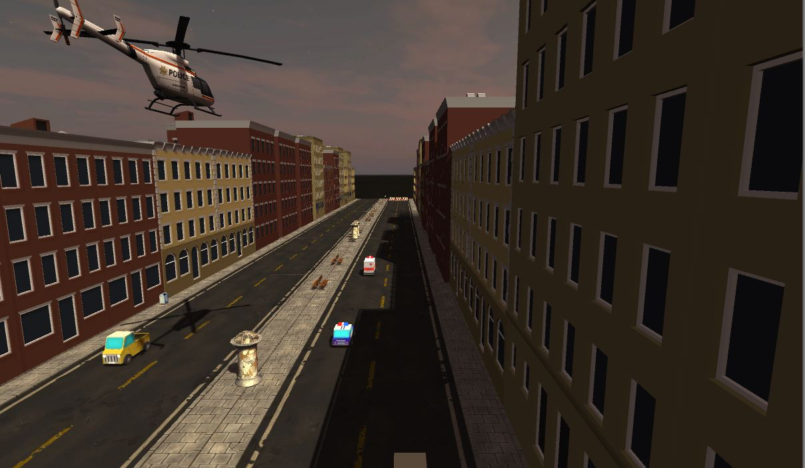
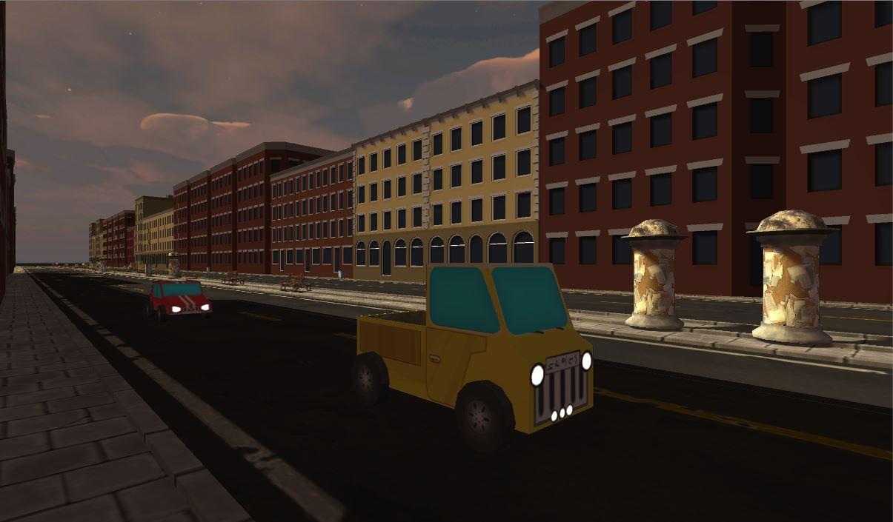
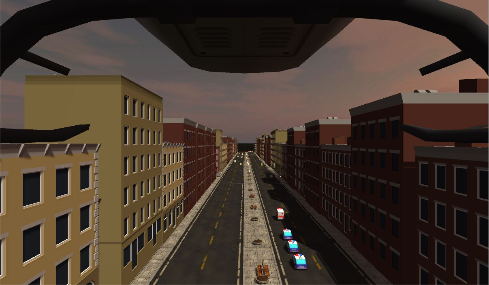
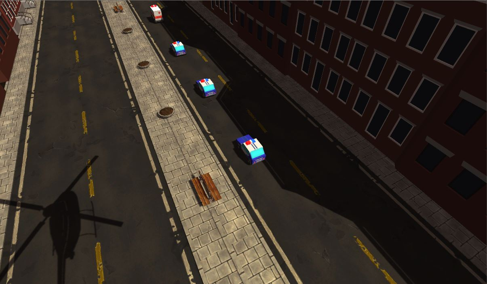
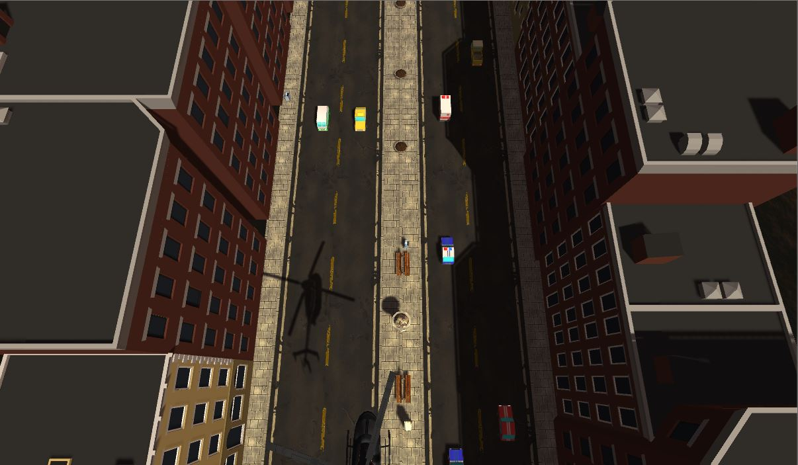

# Unity base project

References:
https://thoughtbot.com/blog/how-to-git-with-unity
https://docs.unity3d.com/Manual/SmartMerge.html

A "cutescene" of a street with sound, cars and helicopter, everything animated. The camera views will change during the duration of the cutescene, showing multiple diferent angles.

